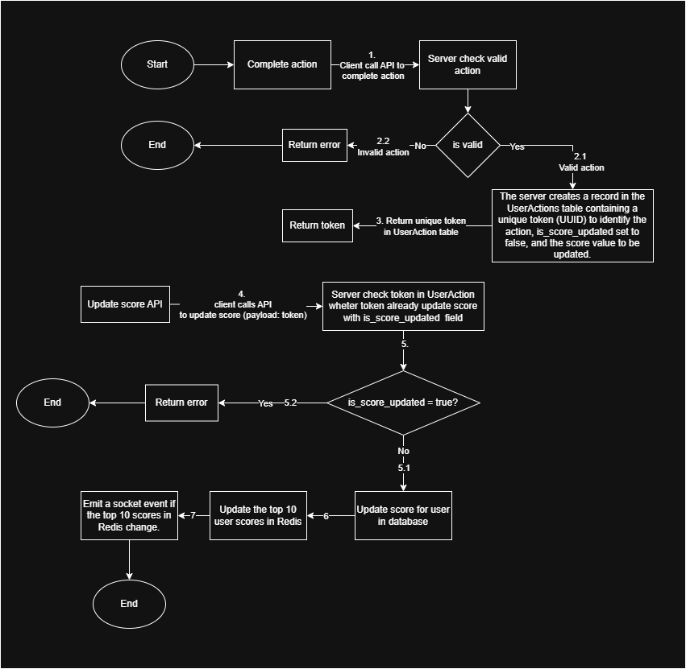

# API Service Documentation

This document outlines the specification for the API module that enables action completion, score updating, and top 10 user score management in the backend application server.

---

## Overview

The API service is responsible for handling user actions, updating user scores, and ensuring the integrity of the scoring system. It prevents unauthorized manipulation by leveraging unique tokens and Redis caching for efficient real-time operations.

---

## Features

1. **Complete Action:**

   - Users can perform specific actions that generate a unique token.
   - The token is stored in the database with a reference to the user, action, and score.

2. **Update Score:**

   - Users call an API to update their score by providing the generated token.
   - The system validates the token and ensures scores are updated only once.

3. **Top 10 User Scores:**
   - Updates the top 10 user scores in Redis for fast retrieval.
   - Emits a socket event when the leaderboard changes.

---

## API Endpoints

### 1. Complete Action

**Endpoint:** `POST /api/action/complete`
**Authorization:** `Bearer <jwt_token>`

**Request Body:**

```json
{
  "actionId": "<action_id>"
}
```

**Response:**

- **Success:**

```json
{
  "token": "<unique_token>"
}
```

- **Error:**

```json
{
  "error": "Invalid action"
}
```

**Logic:**

1. Validate the action ID.
2. Generate a unique token (UUID).
3. Create a record in the `UserActions` table with:
   - `user_id`
   - `action_id`
   - `token`
   - `is_score_updated` (default: `false`)
   - `score` (value associated with the action).
4. Return the token.

---

### 2. Update Score

**Endpoint:** `PATCH /api/user/score`
**Authorization:** `Bearer <jwt_token>`

**Request Body:**

```json
{
  "token": "<unique_token>"
}
```

**Response:**

- **Success:**

```json
{
  "message": "Score updated successfully"
}
```

- **Error:**

```json
{
  "error": "Token is invalid or score already updated"
}
```

**Logic:**

1. Validate the token:
   - Check if the token exists in `UserActions`.
   - Ensure `is_score_updated` is `false`.
2. Update the user's score in the database.
3. Set `is_score_updated` to `true` in `UserActions`.
4. Update the top 10 scores in Redis.
5. Emit a socket event if the top 10 scores change.

---

## Database Design

### Tables

#### **User**

| Column    | Type    | Constraints |
| --------- | ------- | ----------- |
| id        | bigint  | Primary Key |
| user_name | varchar |             |
| full_name | varchar |             |
| score     | int     | Indexed     |

#### **Action**

| Column | Type    | Constraints |
| ------ | ------- | ----------- |
| id     | bigint  | Primary Key |
| name   | varchar |             |

#### **UserAction**

| Column           | Type    | Constraints             |
| ---------------- | ------- | ----------------------- |
| user_id          | bigint  | Foreign Key (User.id)   |
| action_id        | bigint  | Foreign Key (Action.id) |
| token            | uuid    | Primary Key             |
| is_score_updated | boolean | Default: false          |
| score            | int     |                         |

---

## Execution Flow

### Sequence of Operations

1. **Complete Action:**
   - Client sends a request to complete an action.
   - Server validates the action and generates a unique token.
   - Server saves the token, action, and score in the database.
2. **Update Score:**
   - Client sends a request to update the score using the token.
   - Server verifies the token and updates the score if valid.
   - Server updates the leaderboard in Redis and emits a socket event if changes occur.

---

## Diagram

### Flow Diagram



### Database Schema


---

## Improvements

1. **Error Handling:**

   - Add more descriptive error codes and messages.
   - Implement rate-limiting to prevent abuse of APIs.

2. **Performance Optimization:**

   - Cache frequently accessed actions in Redis to reduce database queries.

3. **Scalability:**

   - Use a job queue (e.g., Bull or RabbitMQ) for score updates to offload processing from the main thread.

4. **Security Enhancements:**

   - Sign tokens with HMAC or JWT to prevent tampering.
   - Use HTTPS to secure API communication.

5. **Monitoring:**
   - Add logging and metrics for API usage and leaderboard updates.

---

## Notes

- Ensure unique constraints on the `UserActions.token` column.
- Regularly expire and clean up old tokens from the database to save storage.

---

This documentation serves as the primary reference for the backend engineering team to implement the module.
